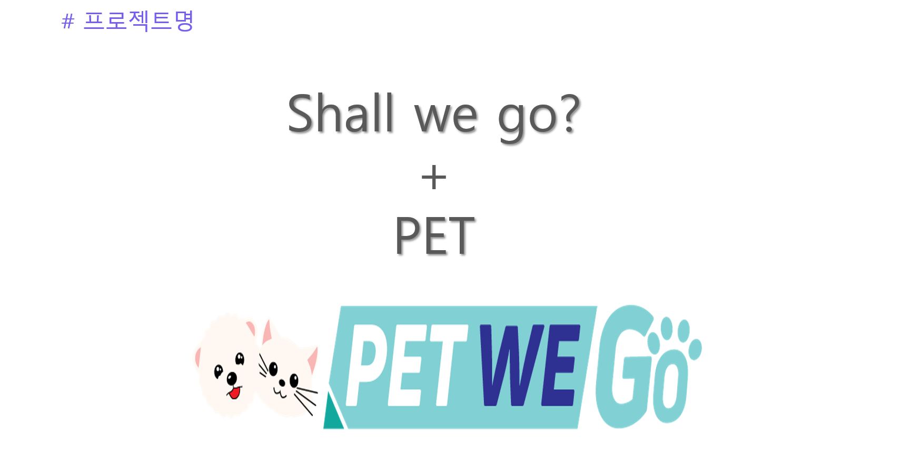

# Bit_Project Pet We GO

### 소개&기획의도 

+ 기획의도 

바야흐로 반려동물 천만시대가 도래한 지금, 반려동물과 연관된 검색어 검색량의 증가 혹은 반려동물과 관련된 유튜브 채널, TV 프로그램이 
인기를 끌고 있습니다. 그만큼 반려동물과 함께사는 반려인의 인구수가 증가하였고, 함께 보내는 시간이 많아졌는데요.
이러한 점에 착안하여 반려견, 반려묘 등에 관련된 콘텐츠를 만들어 보기로 결정하였습니다. 

다양한 아이디어 속에서 저희는 반려동물과 함께하는 여행정보 뿐 아니라, 반려동물을 키우는 반려인들의 소모임과 교류가 중점이 되어 
반려인과 동물 모두 행복할 수 있는 서비스를 구현해보자는 생각으로 이 프로젝트를 기획하였습니다.

***
### 개발일정

### 사용기술

***
### 팀원소개(역할분담)

### 시연영상 
유튜브에 올려주시면 링크추가예정
